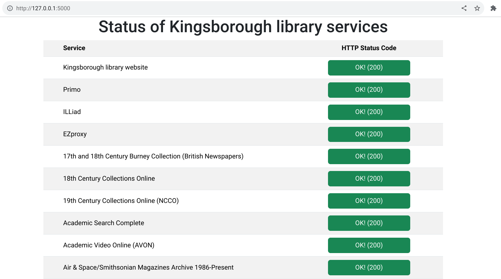

# library-status-page

This web application displays a status page that has queried the library's various external services and returned their HTTP status codes, which are helpfully color-coded to show which ones have failed.

